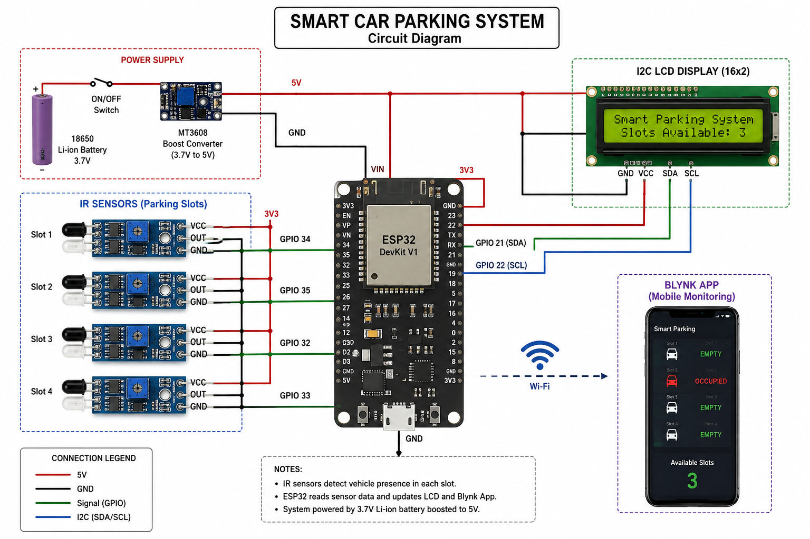

# Smart Car Parking System

## Project Overview
An IoT-based Smart Car Parking System developed using ESP32, IR sensors, Blynk, and an I2C LCD to monitor parking slot availability.

## Features
- Real-time parking slot detection
- LCD displays slot availability
- Blynk mobile app monitoring
- Wi-Fi communication using ESP32

## Components Used
- ESP32 DevKit V1
- 4 IR Sensors
- I2C LCD Display
- Jumper Wires
- Breadboard
- Power Supply

## Hardware Setup

## Circuit Diagram

## Software Used
- Arduino IDE
- Blynk IoT Platform

## How to Run
1. Open the project in Arduino IDE.
2. Install the required libraries.
3. Update your Wi-Fi and Blynk credentials.
4. Upload the code to ESP32.

## Results
The system successfully detects vehicle occupancy, updates the LCD, and sends the parking status to the Blynk application in real time.
